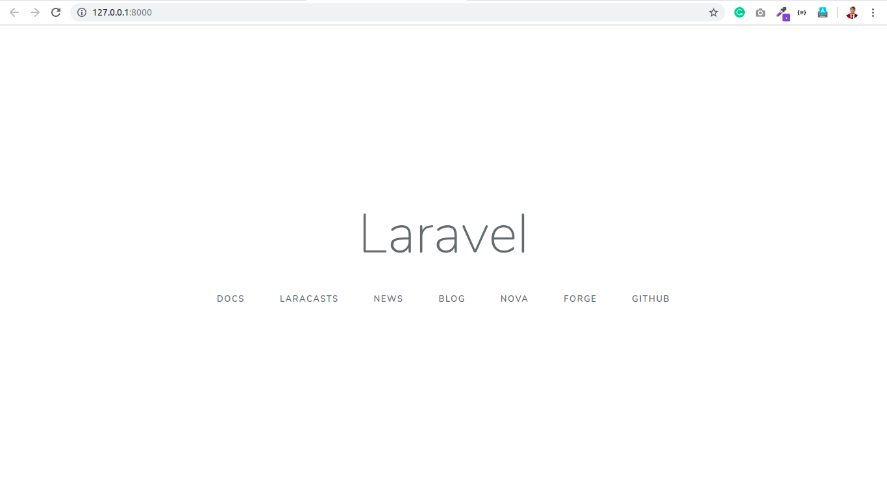

I have decided to try out my hands on laravel after a while. This would have two distinct advantages. One is that I will get hands-on experience about the best in class PHP framework, and other is that I can find new features to implement in Blazing. 

Starting with laravel was pretty tough, as I decided to not use ***Homestead*** and go through the conventional composer installation. My PHP installation missed two extensions, and installing them has not been a difficult task. 

Then, a simple `php artisan serve` showed me this page. 🤩

## Routing
---
Laravel has a vast routing mechanism. My current version of Blazing only has two **HTTP** verbs, whereas Laravel has six. I don't think adding all these verbs would benefit, comprehending the userbase and needs of beginners. After all, laravel is known for it's learning curve and Blazing is all about the absence of the same. 

### `Route::match(*array*, *url*, *function*)`
Route::match is something I would like to implement in Blazing (*read my framework*). This allows using a single route to respond to different sorts of requests. Similar is `Route::any(*url*)` which responds to all types of requests.

### `Route::redirect(*from*,*to*,*status*)`
The redirect method is used to redirect the request with a custom status code like 301 for permanent, 302 for temporary, etc. I don't think this would be required in Blazing as a simple `header()` function can be used to perform the equivalent.

### `Route::view(*url*,*view*)`
Now, this is handy! In my projects, I've sometimes defined controllers only to load a page for the user. With this function, one can instantly load the view without requiring a controller! This is unquestionably coming to blazing.

## Route Parameters
---
Sometimes we will need to capture segments of the URL within your route. For example, you may need to capture a user's ID from the URL. In such a situation, these are extraordinarily helpful and are considered one of the most important features of a framework, hence already in Blazing. 

Laravel defines a curly bracket syntax for variables in URLs. Something like `explore/user/{userId}` would pass a variable titled `userId` into the controller. In Blazing, however, there's a diverse method. There, `explore/user/$userId` would pass the userId variable into the controller. I chose to use the ***`$(dollar)`*** syntax because variables in PHP are declared using a dollar and it would be natural for lads to associate. Easy for novices 🤗 

>Route parameters are always encased within {} braces and should consist of alphabetic characters, and may not contain a - character. Instead of using the - character, use an underscore (_).

I'm a gratified developer saying that Blazing has no such limitation. (even a broken clock is right twice a day🤣). Variable names can contain numbers and can contain a dash(-)

## It's VAST😕
---
There are many things which are not incorporated in this blog post. Things like optional parameters, regular expression constraints, global constraints, encoded forward slashes, named routes, generating URL to named routes, route groups, middlewares, namespaces, sub-domain routing, route prefixes, route name prefixes, rate limiting are left for enthusiasts. 😵

Stay tuned for more posts on technology and computer science. 