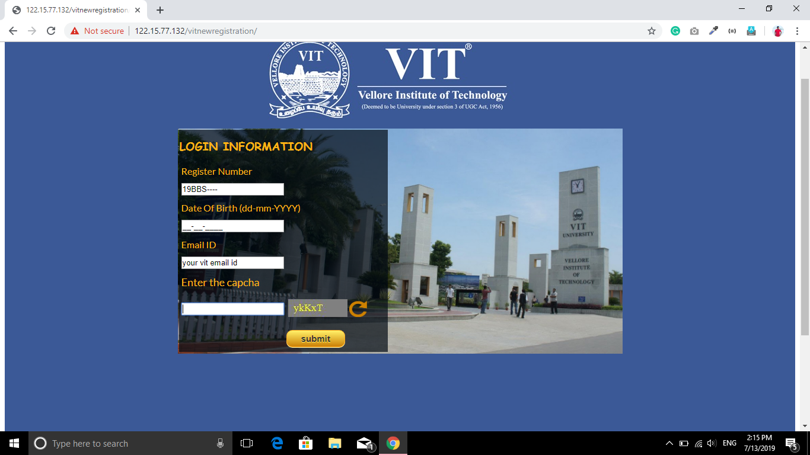
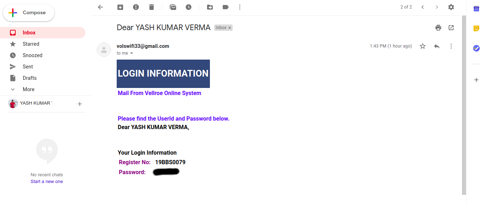
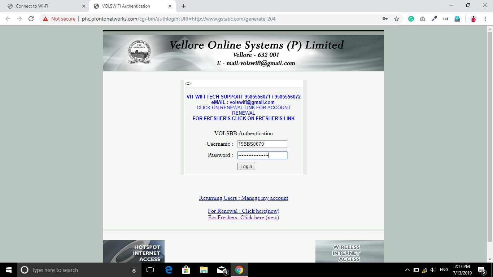
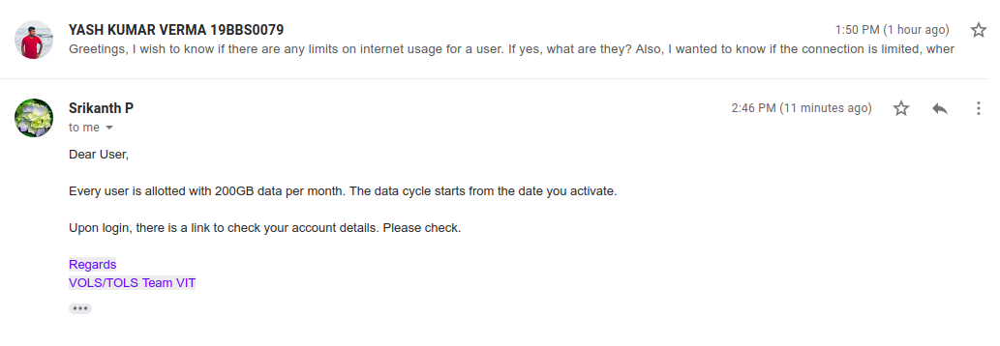

Hello there ! fellow freshers. Yup. I'm a fresher as well! and just like me, most of you all would be just as frustrated regarding the condition of the cellular network in the campus area. The icing on the cake is that we don't have access to the campus wifi as well! (not till I'm drafting)

So hold onto your seats and get ready for this. Let's conquer the WIFI !!!

---

# Step 1

Step one. [Visit this link](http://122.15.77.132/vitnewregistration)  on your own network. (***repeat, on your own network. NOT ON WIFI.***)

# Step 2
Step two. Fill in the details. You can get your email credentials in the VTOP profile. **Use that (vitstudent) email only**. Next, log into your email and get the wifi credentials. From your email, note down the password along with your registration number.

# Step 3
Step three. Connect to any open campus wifi wherever it's available. (can't help it if your hostels don't have it open yet 🤣 ). Head over to Sign-In, then fill the details.

# Step 4 
Come on. That's all 😎. There are no additional steps.

---

# Additional Finding
> If there's a mystery bothering you that what's the data limit, it's ***200 GB PER MONTH***

>I've also noticed that we cannot connect two devices at a single time. 

---

Thanks, folks. Share with your mates to help them enjoy as well. 